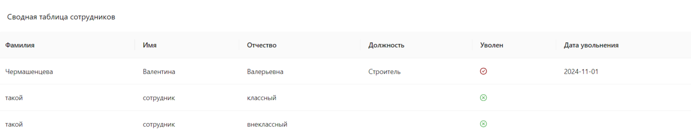

## Тестовое задание для компании Медион

### Стек
- Django + DRF
- React + axios, ant design

### Инструкции
#### Backend
- `python -m venv venv`
- `source venv/Scripts/activate`
- `pip install -r requirements.txt`
- `python manage.py runserver` 

#### Frontend
- `npm create vite@latest`
- `npm install`
- `npm run dev`
---
Пример таблицы:

